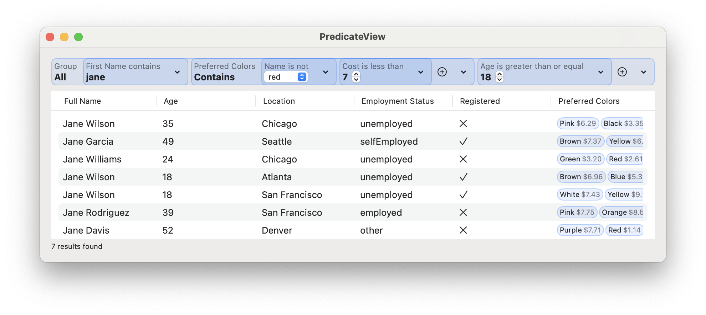
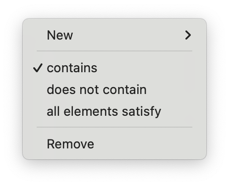

# PredicateView

A SwiftUI control for viewing and editing Swift Predicates



## Motivation

[`NSPredicateEditor`](https://developer.apple.com/documentation/appkit/nspredicateeditor) is amazing, but doesn't (and likely won't) have support for Foundation's new [Swift Predicates](https://forums.swift.org/t/pitch-swift-predicates/62000) feature ([proposal link](https://gist.github.com/jmschonfeld/6821392a968a1a1a42aba3c96d333239)).

In addition – not that it matters – as an AppKit control, `NSPredicateEditor` doesn't support other platforms.

This repo is an experiment on designing and implementing a cross-platform SwiftUI-native control for viewing and editing Swift Predicates. In addition, `PredicateView` has a more compact UI representation, especially when editing more complex predicates.

## Getting Started

A `PredicateView` can be initialized using a binding to a [`Predicate`](https://developer.apple.com/documentation/foundation/predicate) and a collection of row templates. Note: it purposefully uses the same terminology for row templates as `NSPredicateEditor`.

`PredicateView` has built-in support for common primitive and compound Swift types, including `Bool`, `String`, `Numeric`, `CaseIterable`, and `RawRepresentable`. It uses appropriate customized UI controls for each one, such as menus for enums, segmented controls for booleans, and steppers for numeric data.

You construct a `PredicateView` by providing a `Binding` to a `Predicate` over your model type. You then provide a collection of row templates, which define the set of properties the user will be able to filter through. Each template must contain a `KeyPath` in your model type, as well as a user-friendly title. 

As the user makes changes to the predicate using the `PredicateView` UI, the value of the predicate will update. If your model instance conforms to `Sequence`, you can easily filter it using the predicate by calling the Swift standard library `filter(_:)` method. Note that it is a good practice to opt into updating the filtered-down representation of the model live as the user interacts with the `PredicateView` UI, instead of requiring the user to interact with an additional control, such as an explicit Search button.

### Optionals

`PredicateView` has built-in support for optionals of all supported types. If a given row template uses an optional `KeyPath`, the user will be able to filter over the existence or non-existence of values, in addition to the values themselves.

### Collections

You can provide nested row templates for `Collection` backed data, which will allow the user to customize their query even more, filtering over containment or filtering elements that satisfy all of the conditions.

```swift
.init(keyPath: \.preferredColors, title: "Preferred Colors", rowTemplates: [
    .init(keyPath: \.name, title: "Name"),
    .init(keyPath: \.cost, title: "Cost"),
]),
```



### Sample Code

See the built-in `PredicateDemoView` for a complete sample use case.

```swift
/// A sample model type.
struct Model: Identifiable {
    enum EmploymentStatus: String, CaseIterable, Codable {
        case employed
        case unemployed
        case selfEmployed
        case student
        case other
    }
    
    let id = UUID()
    let firstName: String
    let age: Int
    let employmentStatus: EmploymentStatus
    let isRegistered: Bool
}

/// A sample predicate.
@State var predicate: Predicate<Model> = .true

/// A predicate view that supports filtering through first names, age, employment, and registration status.
PredicateView(predicate: $predicate, rowTemplates: [
    .init(keyPath: \.firstName, title: "First Name"),
    .init(keyPath: \.age, title: "Age"),
    .init(keyPath: \.employmentStatus, title: "Employment Status"),
    .init(keyPath: \.isRegistered, title: "Registration Status"),
    .init(keyPath: \.preferredColors, title: "Preferred Colors", rowTemplates: [
        .init(keyPath: \.name, title: "Name"),
        .init(keyPath: \.cost, title: "Cost"),
    ]),
])
```

## Features

- [x] Easy setup
- [x] Type safety
- [x] Built-in support for optionals and nested expressions
- [x] Rich representations for supported data types
- [x] SwiftData support
- [x] Support for custom controls for row templates

## Not Features

As an experimental control, `PredicateView` does not support the following capabilities. It would, however, be great to see them implemented in the future.

- [ ] Fully custom appearance and custom token views
- [ ] A rich text experience using text attachments
- [ ] Support for all built-in `PredicateExpression`s

## Advanced Capabilities

### Custom Predicate Views

The `CustomExpressionView` protocol allows you to build custom expression views for key paths not covered by the standard set of built-in expressions. For example, when working with CloudKit in SwiftData, you may choose to implement a custom picker for your enums and dynamically convert them to raw values for their representation in the model layer.

A custom predicate expression may be used as a row template just like any of the standard ones:

```swift
PredicateView(predicate: predicate, rowTemplates: [
    .init(keyPath: \.title, title: "Title"),
    .init(keyPath: \.creationDate, title: "Creation date"),
    .init(keyPath: \.modificationDate, title: "Modification date"),
    // Custom expression view:
    .init(StatusExpressionView.self),
])
```

See the sample project for additional details.

### Decoding Predicates

`PredicateView` supports taking `Predicate`s as input and populating the control from them. This makes it convenient to store user-built predicates in a database and subsequently allowing your users to modify them. Most built-in expression view types support decoding. Custom expressions may choose to opt into the decoding capability by implementing a single method. The decoding support is opt-in and *not* all-or-nothing. You may elect some expression views to not allow decoding, in which case they will not be populated when the control is instantiated using a non-trivial `Predicate` instance. Conformance is independent, so this decision does not affect other custom expression views or any of the built-in ones.

## Compatibility

Compatibility matches that of the [Swift predicates](https://forums.swift.org/t/pitch-swift-predicates/62000) feature; namely macOS 14.0+, iOS 17.0+, watchOS 10.0+, visionOS 1.0+.
